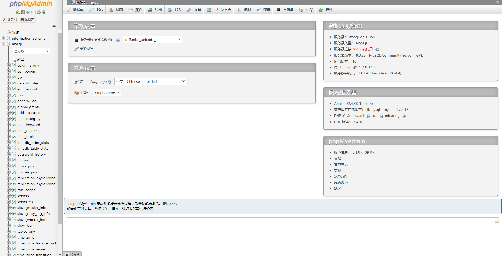
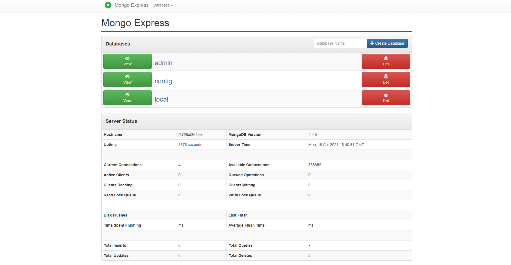
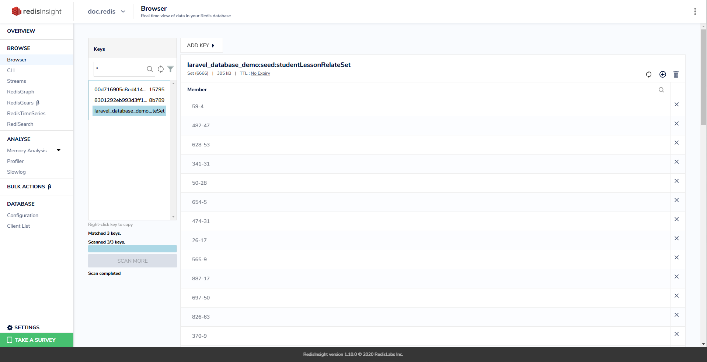
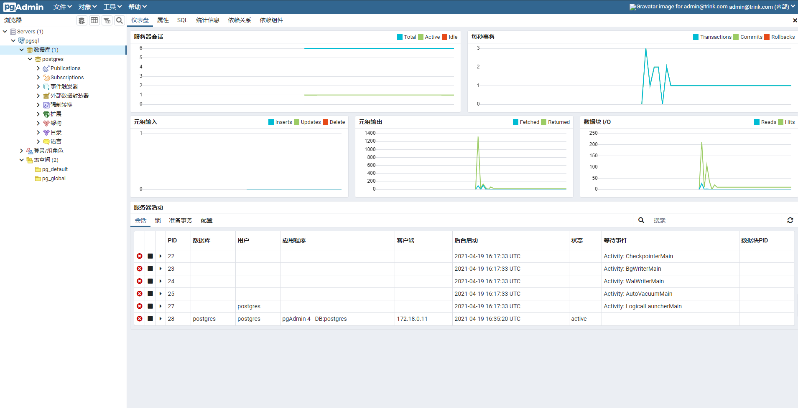
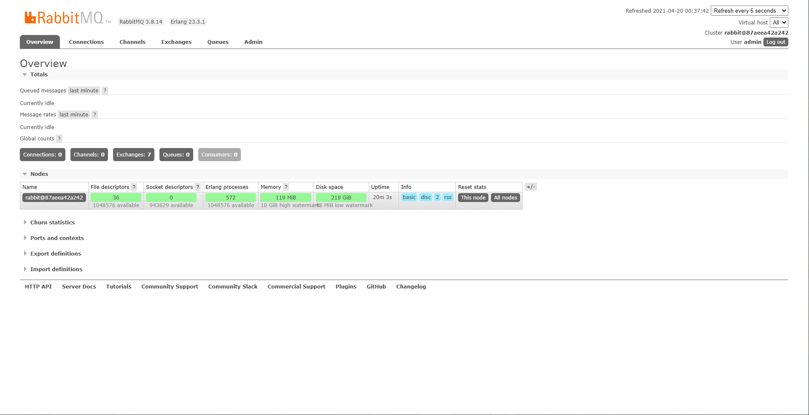
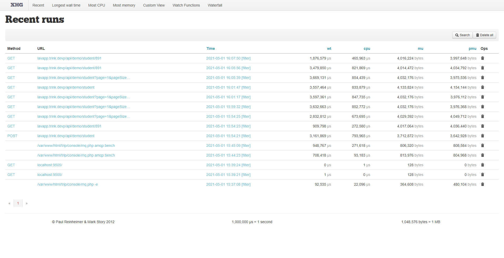

## 环境列表

> 环境变量已经提取到 .env.example 中, 使用时改名为 .env, 根据自己的环境适配变量
> 
> 当前目录打开命令行, 使用 `.\run.bat up -d` 即可部署环境, 使用 `.\run.bat start/re/stop` 开启/重启/停止环境

- [PHP 服务](./deploy-php.yml)
  - [x] php8-apache
  - [x] php7-fpm-alpine
  - [x] php7-cli-alpine
- [服务器](./deploy-server.yml)
  - [x] nginx-alpine
  - [x] pgsql-alpine `postgre/123123`
  - [x] mysql(with sysbench) `root/123123`
  - [x] mongo `root/123123`
  - [x] redis-alpine `123123`
  - [x] memcached-alpine
  - [x] rabbit-management-alpine `admin/123123`
- [数据服务工具](./deploy-toolkit.yml)
  - [x] pgadmin4 `admin@trink.com/123123`
  - [x] phpmyadmin `免密`
  - [x] mongo-express `免密`
  - [x] redisinsight `免密`

## 存在问题

- [x] windows10 wsl2 环境不支持 mysql 映射到本地的操作, 可以使用 volume 解决
- [x] `my.cnf` 配置失效, 需要把 `my.cnf` 的权限必须设置为只读模式
- [x] mongodb 的 /data 目录映射不到 windows 主机, 可以使用 volume 解决
- [x] pgsql 的 `/var/lib/postgresql/data` 目录映射不到 windows 主机, 可以使用 volume 解决
- [x] rabbitmq 的 `/var/lib/rabbitmq/mnesia` 是数据目录, 容器重启的时候, 不能持久化在本地, 可以使用 volume 解决
- [ ] docker alpine 镜像大小优化

## PHP 环境简介

**PHP 各版本**

> 该环境使用的是自己编译的镜像, 编译时打开了大部分的扩展, 又额外增加了许多扩展, 所以镜像文件会比较大

**加入的扩展**

- `imagick` 图像处理, 类似于 gd, 功能更多
- `psr` 约定的 PHP 标准规范
- `redis` 操作调用 redis
- `memcache` 操作调用 memcached
- `memcached` 操作调用 memcached, OO 写法
- `apcu` PHP 缓存
- `mongodb` 操作调用 mongodb
- `amqp` 操作调用实现 amqp 协议的消息队列
- `yaml` 操作 yml 文件
- `vld` 显示 opcode
- `grpc` PHP 的 grpc
- `protobuf` grpc 使用的数据传输格式
- `msgpack` 类似 json, 比 json 更轻

**版本简介**

- php-apache 版本自己可以提供 apache 的服务, 不需要额外的代理服务器, 配置文件在 `apache/000-default.conf`
- php-fpm-alpine 版本, 除了加入的扩展之外, 还集成了 xdebug(断点调试), tideways_xhprof(性能分析) 等扩展
- php-cli-alpine 版本, 除了加入的扩展之外, 还集成了 swoole 系列 (+swoole_postgresql, +swoole_orm, +sdebug, +swoole_serialize, +swoole_zookeeper) 等扩展

### tideways_xhprof

> 抓取单机性能分析的数据

```php
if (extension_loaded('tideways_xhprof')) {
    // tideways_xhprof_enable(TIDEWAYS_XHPROF_FLAGS_NO_BUILTINS);
    tideways_xhprof_enable(TIDEWAYS_XHPROF_FLAGS_MEMORY | TIDEWAYS_XHPROF_FLAGS_CPU);

    // 程序结束时执行
    register_shutdown_function(
        static function () {
            file_put_contents(
                sprintf(
                    '%s/%s.trip.xhprof',
                    get_cfg_var('xhprof.output_dir') ?: sys_get_temp_dir(),
                    uniqid()
                ),
                json_encode(['profile' => tideways_xhprof_disable()], JSON_THROW_ON_ERROR)
            );
        }
    );
}
```

## Mysql 环境简介

### sysbench 数据库压测

> /usr/local/share/sysbench/ 有很多 lua 脚本

```
# 准备数据
sysbench /usr/local/share/sysbench/oltp_read_write.lua --tables=10 --table_size=500000 --mysql-user=root --mysql-password=123123 --mysql-db=sbtest --threads=4 prepare
# 执行测试
sysbench /usr/local/share/sysbench/oltp_point_select.lua --tables=10 --table_size=500000 --mysql-user=root --mysql-password=123123 --mysql-db=sbtest --threads=4 --time=60 --report-interval=10 run
# 清理数据
sysbench /usr/local/share/sysbench/oltp_read_write.lua --tables=10 --table_size=500000 --mysql-user=root --mysql-password=123123 --mysql-db=sbtest cleanup
```

### mysqldumpslow 慢日志分析

```
-s: 排序方式. 默认at
    al: average lock time 平均锁定时间
    ar: average rows sent 平均返回行数
    at: average query time 平均查询时间
c: count 总执行次数
l: lock time 总锁定时间
r: rows sent 总返回行数
t: query time 总查询时间
-t: show the top n queries, 显示前多少名的记录
-a: 默认不开启. 值为绑定值 N, 若开启, 显示真实值
-g: 类似于 grep 命令, 过滤出需要的信息
-l: 总时间中包含锁定时间

# 例
mysqldumpslow -s c -t 10 /var/lib/mysql/slow.log
mysqldumpslow -s t -t 10 -g "left join" /var/lib/mysql/slow.log
mysqldumpslow -s r -t 20 /var/lib/mysql/slow.log | more # 结合 | 和 more 使用, 否则可能出现刷屏的情况
```

## 数据可视化工具

> 服务器的数据服务不建议对外开放

### phpmyadmin

> localhost:8801



### mongo-express

> localhost:8802



### redis-insight

> localhost:8803



### pgadmin4

> localhost:8804



### rabbit-manage

> localhost:8805



### xhgui

> localhost:8806

- 建议将 `templates/runs/paginated-list.twig:58` 中的 `SERVER.SERVER_NAME` 改成 `SERVER.HTTP_HOST`



